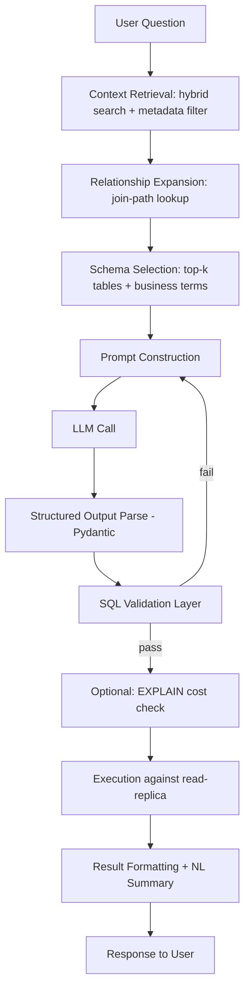
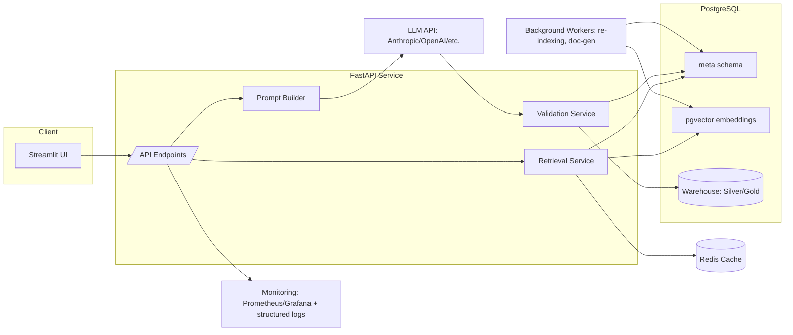
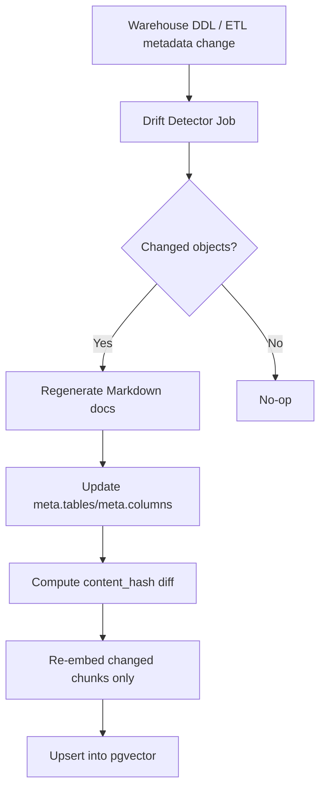
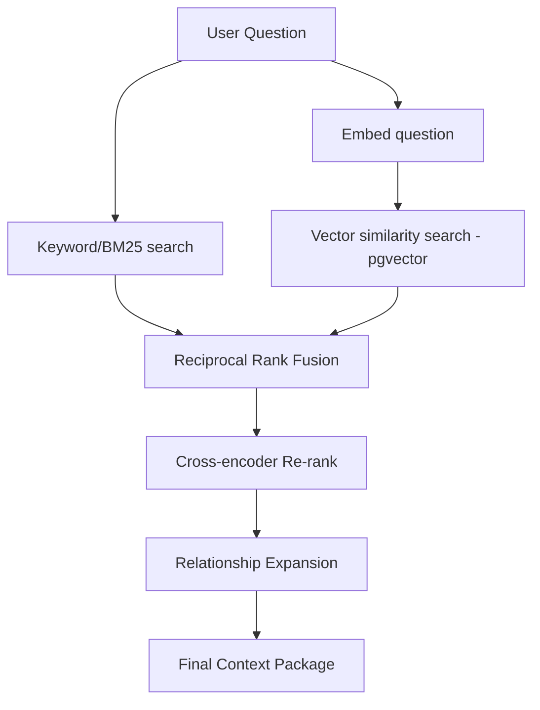
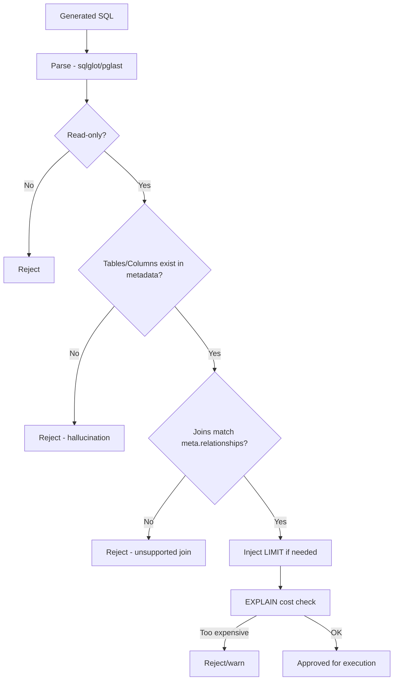

# Enterprise Text-to-SQL AI Accelerator — Solution Architecture

**Scope:** 288 warehouse objects (82 Silver tables + 38 Silver views + 206 Gold tables + 106 Gold views), Medallion architecture, PostgreSQL target, metadata-driven ETL.

---

## 1. Context Design Strategy

### 1.1 What lives where

| Content | Store | Why |
|---|---|---|
| Table/column definitions, types, PK/FK, business descriptions | **PostgreSQL metadata schema** (`meta.*` tables) | Structured, queryable, joinable, single source of truth, easy to keep in sync with ETL metadata |
| Embeddings of table/column/business-term descriptions | **Vector DB (pgvector)** | Semantic retrieval over natural-language questions |
| Human-authored glossary, query patterns, worked examples | **Markdown files**, ingested into vector DB at build time | Easiest for SMEs/data stewards to edit; version-controlled in git |
| Relationship graph (FK + inferred joins) | **PostgreSQL adjacency table** + optional graph store (Apache AGE) | Needed for deterministic join-path resolution, not just similarity |
| Runtime query logs, feedback, approved SQL | **PostgreSQL** | Auditability, fine-tuning corpus, few-shot example bank |

**Principle:** PostgreSQL is the system of record for *facts* (schema, relationships, ETL metadata). The vector DB is a *derived index* over those facts for retrieval — it can always be rebuilt from Postgres + Markdown, never hand-edited independently.

### 1.2 Metadata schema (`meta` schema in Postgres)

```sql
CREATE SCHEMA meta;

CREATE TABLE meta.tables (
    table_id            SERIAL PRIMARY KEY,
    layer               TEXT CHECK (layer IN ('bronze','silver','gold')),
    schema_name         TEXT NOT NULL,
    table_name          TEXT NOT NULL,
    object_type         TEXT CHECK (object_type IN ('table','view')),
    business_description TEXT,
    grain               TEXT,               -- e.g. "one row per order line"
    refresh_frequency   TEXT,
    scd_type            TEXT,
    source_table        TEXT,
    dependencies        TEXT[],
    row_count_estimate  BIGINT,
    is_deprecated       BOOLEAN DEFAULT FALSE,
    updated_at          TIMESTAMPTZ DEFAULT now()
);

CREATE TABLE meta.columns (
    column_id           SERIAL PRIMARY KEY,
    table_id            INT REFERENCES meta.tables(table_id),
    column_name         TEXT NOT NULL,
    data_type           TEXT NOT NULL,
    is_pk               BOOLEAN DEFAULT FALSE,
    is_fk               BOOLEAN DEFAULT FALSE,
    fk_ref_table        TEXT,
    fk_ref_column       TEXT,
    business_synonyms   TEXT[],
    business_description TEXT,
    sample_values       TEXT[],
    is_audit_column     BOOLEAN DEFAULT FALSE,
    nullable            BOOLEAN
);

CREATE TABLE meta.relationships (
    relationship_id     SERIAL PRIMARY KEY,
    from_table          TEXT,
    from_column         TEXT,
    to_table            TEXT,
    to_column           TEXT,
    join_type           TEXT,          -- inner/left, cardinality 1:1, 1:N
    verified            BOOLEAN DEFAULT FALSE,
    source              TEXT           -- 'fk_constraint' | 'etl_metadata' | 'manual'
);

CREATE TABLE meta.business_glossary (
    term_id             SERIAL PRIMARY KEY,
    term                TEXT NOT NULL,
    definition          TEXT,
    maps_to_tables      TEXT[],
    maps_to_columns     TEXT[],
    synonyms            TEXT[]
);

CREATE TABLE meta.query_patterns (
    pattern_id          SERIAL PRIMARY KEY,
    intent_description  TEXT,
    example_question     TEXT,
    sql_template         TEXT,
    tables_used          TEXT[]
);
```

This schema is populated **automatically** by a nightly job that reads the existing ETL metadata tables (already used for Bronze→Silver→Gold loading) — no duplicate manual entry.

### 1.3 Organization strategy: split by **table**, tagged by **domain + layer**

Chunk granularity = **one table/view = one context document**, each tagged with `layer`, `domain` (e.g. Sales, Finance, HR — derived from schema_name or a domain-mapping table), and `object_type`. This is preferred over splitting by domain-only because:
- Retrieval needs table-level precision (wrong table = wrong SQL).
- Domain tags are used as **metadata filters**, not the retrieval unit itself — this gives a two-stage funnel (filter by domain → semantic rank within domain).

### 1.4 Relationships representation
Store FK constraints from `information_schema` **plus** ETL-declared relationships (which capture logical joins not enforced by physical FKs, common in Gold reporting tables). Represent as a directed graph; expose via a `get_join_path(table_a, table_b)` function using BFS over `meta.relationships` so the LLM is given a *pre-computed* join path rather than asked to infer one.

### 1.5 Business terminology linkage
`meta.business_glossary` maps a business term ("churned customer", "net revenue") to specific tables/columns/filter logic. This is embedded and retrieved alongside table context so the LLM translates business language deterministically instead of guessing.

### 1.6 Versioning & automated updates
- Every row in `meta.tables`/`meta.columns` has `updated_at`; a trigger writes changes to `meta.change_log`.
- A CI/CD job (dbt or custom Python) runs on every warehouse DDL change: diffs `information_schema` against `meta.tables`, flags drift, regenerates Markdown docs, and re-embeds only the changed objects (incremental re-indexing, not full rebuild).
- Vector DB documents are tagged with `content_hash`; only chunks whose hash changed are re-embedded — keeps embedding costs low at 300+ objects.

### 1.7 Auto-generated documentation
A generator script introspects Postgres (`information_schema`, `pg_constraint`, `pg_description` comments) to auto-produce the base Markdown skeleton per table, which SMEs then enrich with business descriptions. This guarantees the docs never drift structurally from the real schema even if business enrichment lags.

---

## 2. Context Retrieval Strategy

### 2.1 Recommended approach: **Hybrid retrieval + metadata filtering**, not pure RAG

For 300+ tables, pure semantic search alone is insufficient (business questions are short and ambiguous; embeddings alone confuse similarly-named tables like `fact_sales` vs `fact_sales_returns`). Recommended pipeline:

1. **Metadata pre-filter**: layer preference (Gold first), domain tag if inferable from the question, `is_deprecated = false`.
2. **Hybrid search**: BM25/keyword (via Postgres `tsvector` or Elasticsearch) + dense vector similarity (pgvector), combined via **Reciprocal Rank Fusion (RRF)**.
3. **Re-ranking**: cross-encoder re-ranker (e.g. `bge-reranker-v2-m3` or Cohere Rerank) over top ~30 candidates → top 5–8.
4. **Relationship expansion**: for each selected table, pull in directly-joined tables from `meta.relationships` even if they didn't rank highly (ensures join completeness).
5. **Context compression**: strip unused columns' verbose descriptions once a table is selected; keep only column name, type, PK/FK flag, and one-line description unless the question references that column specifically.

**GraphRAG / knowledge graph**: useful as a *secondary* structure for join-path resolution (§1.4), not as the primary retrieval mechanism — full GraphRAG (LLM-summarized community graphs) is overkill for a well-structured relational warehouse and adds latency/cost without proportional benefit here.

**MCP**: appropriate as the *transport/tooling layer* — expose `search_tables`, `get_table_schema`, `get_join_path`, `validate_sql` as MCP tools so the same retrieval/validation logic is reusable across FastAPI backend, Streamlit app, and any future agent client (e.g., Claude Code or a chat client) without re-implementation.

### 2.2 Embeddings, chunking, tagging
- **Embedding model**: `text-embedding-3-large` (OpenAI) or open-source `bge-large-en-v1.5` for on-prem. One vector per table-chunk; a second vector per business-glossary term (short chunks, high hit rate for terminology matching).
- **Chunk size**: table chunks ~300–500 tokens (name, description, grain, columns with synonyms, sample values). Larger tables get column sub-chunks linked by `table_id` metadata, merged back at retrieval time.
- **Metadata tags per chunk**: `layer`, `domain`, `object_type`, `table_name`, `content_hash`, `is_deprecated`.
- **Confidence scoring**: combine re-ranker score + FK-graph connectivity of selected tables; below a threshold, trigger the **ambiguity-clarification** path (§5) instead of guessing.

---

## 3. Prompt Engineering

### 3.1 System Prompt (template)

```
You are an expert PostgreSQL query generator for an enterprise data warehouse.

RULES:
1. Use ONLY the tables, views, and columns provided in the CONTEXT block below.
   Never invent table or column names. If the needed data is not present in
   CONTEXT, respond with: {"error": "insufficient_context", "missing": "<description>"}.
2. Layer preference: prefer GOLD layer objects. Use SILVER only if no GOLD
   object satisfies the request. Never query BRONZE unless the user explicitly
   names a bronze/raw table.
3. Use only the join paths given in CONTEXT ("join_paths" section). Do not
   infer joins that are not listed.
4. Generate PostgreSQL-compatible syntax only (double-quote identifiers only
   when necessary, use ILIKE for case-insensitive text match, use date_trunc
   for date bucketing).
5. Default to a LIMIT 100 on exploratory queries unless the user asks for an
   aggregate/summary result or explicitly requests more rows.
6. Read-only: never generate INSERT, UPDATE, DELETE, DDL, or GRANT statements.
7. If the request is ambiguous between two tables/columns of similar meaning,
   respond with a clarification request instead of guessing.
8. Output STRICT JSON only, matching the schema given in the user message.
   No prose, no markdown fences.
```

### 3.2 Retrieved context injection (example)

```json
{
  "layer_priority": ["gold", "silver"],
  "tables": [
    {
      "name": "gold.fact_customer_orders",
      "type": "view",
      "grain": "one row per order line",
      "columns": [
        {"name": "order_id", "type": "bigint", "pk": true},
        {"name": "customer_id", "type": "bigint", "fk": "gold.dim_customer.customer_id"},
        {"name": "order_date", "type": "date"},
        {"name": "net_revenue", "type": "numeric", "synonyms": ["net sales", "revenue"]}
      ]
    },
    {
      "name": "gold.dim_customer",
      "type": "table",
      "columns": [
        {"name": "customer_id", "type": "bigint", "pk": true},
        {"name": "customer_segment", "type": "text", "synonyms": ["customer tier"]}
      ]
    }
  ],
  "join_paths": [
    {"from": "gold.fact_customer_orders.customer_id", "to": "gold.dim_customer.customer_id", "type": "inner", "cardinality": "N:1"}
  ],
  "business_terms": [
    {"term": "net revenue", "definition": "gross revenue minus returns and discounts", "column": "gold.fact_customer_orders.net_revenue"}
  ]
}
```

### 3.3 User prompt template (constructed by FastAPI before LLM call)

```
QUESTION: {{ user_question }}

CONTEXT:
{{ retrieved_context_json }}

OUTPUT FORMAT (strict JSON):
{
  "sql": "<postgresql query>",
  "tables_used": ["..."],
  "assumptions": ["..."],
  "confidence": "high|medium|low"
}
```

### 3.4 Best practices applied
- **Grounding**: context is the only source of table/column names; system prompt explicitly forbids invention.
- **Chain-of-thought replacement**: instead of asking for hidden reasoning, ask the model to populate an `"assumptions"` array — this externalizes the reasoning as auditable structured output without requesting a hidden scratchpad.
- **Structured outputs**: strict JSON schema, validated with Pydantic on the FastAPI side; malformed output triggers one automatic retry with the parse error appended.
- **Determinism**: temperature 0, fixed system prompt, versioned prompt templates stored in Postgres (`meta.prompt_versions`) so behavior changes are tracked.
- **Token reduction**: only retrieved tables (typically 2–6) go into context, never the full 288-object catalog.

---

## 4. SQL Generation Pipeline



**Stage detail:**
1. **Context Retrieval** — hybrid search as in §2.
2. **Schema Selection** — dedupe candidate tables, cap at ~8 tables to bound token usage.
3. **Prompt Construction** — inject system + context + user question, versioned template.
4. **LLM call** — temperature 0, JSON mode/structured output.
5. **SQL Validation** — see §5.
6. **Execution** (optional, feature-flagged) — against a **read-only replica**, with a statement timeout and row cap.
7. **Result Formatting** — tabular result + optional NL summary (a second, cheap LLM call over the result set only, not the schema).

---

## 5. Guardrails and Validation

| Check | Approach | Library |
|---|---|---|
| Hallucinated tables/columns | Compare parsed SQL identifiers against `meta.tables`/`meta.columns` | `sqlglot` (parse + resolve) |
| Unsupported joins | Compare ON conditions against `meta.relationships` | `sqlglot` AST walk |
| Syntax validation | Parse with PostgreSQL dialect | `sqlglot`, or `pglast` (real PG parser bindings) |
| AST validation / forbidden ops | Reject any node type outside `SELECT`/`WITH` | `pglast` |
| Read-only enforcement | Whitelist verbs; reject DML/DDL | `sqlglot` + regex fallback |
| SQL injection | N/A for LLM-generated SQL text itself, but enforce parameterization for any user-supplied literals passed separately | `psycopg` parameterized execution |
| LIMIT enforcement | Inject `LIMIT n` if absent and query isn't a pure aggregate | `sqlglot` transform |
| Query complexity | Count joins/subqueries; reject beyond configurable threshold | custom AST metric via `sqlglot` |
| Execution cost estimate | Run `EXPLAIN (FORMAT JSON)` before real execution; reject if estimated cost/rows exceeds threshold | native Postgres `EXPLAIN` |
| Business rule validation | e.g., "net_revenue must not be summed with gross_revenue in the same query" — rule table checked post-parse | custom rules engine, rules in `meta.business_rules` |
| Ambiguity detection | Low re-ranker confidence or two candidate tables both above threshold → return clarification instead of SQL | custom, based on §2.2 confidence score |
| Confidence scoring | Blend: retrieval confidence, validation pass/fail, LLM self-reported confidence | custom weighted score |

Failed validations are **fed back to the LLM** as a structured error (one automatic repair attempt), then surfaced to the user if still failing.

---

## 6. Recommended Architecture

### 6.1 Vector database comparison

| Option | Pros | Cons | Verdict |
|---|---|---|---|
| **pgvector** | Same database as metadata → simple ops, transactional consistency, no extra infra, good enough at this scale (~300 table chunks + glossary, i.e. low thousands of vectors) | Less advanced ANN tuning than dedicated stores at very large scale | **Recommended** — this workload (thousands, not millions, of vectors) doesn't need a dedicated vector DB |
| Qdrant | Fast, filterable, easy self-host | Extra service to operate | Good alternative if scaling beyond ~1M vectors or need advanced payload filtering |
| Milvus | Very high scale, GPU-accelerated | Operationally heavy for this size | Overkill here |
| Weaviate | Built-in hybrid search, modules | Another service, schema duplication risk vs Postgres | Viable, not necessary |
| Pinecone | Fully managed | Cost, external data residency (may conflict with on-prem requirement) | Only if cloud-only and want zero ops |
| FAISS | Fast, free, in-process | No persistence/service layer, no metadata filtering out of the box | Good for prototyping only |

**Recommendation: pgvector.** It keeps schema metadata and embeddings transactionally consistent in one system, satisfies both cloud and on-prem constraints, and is more than sufficient at ~300–1000 chunk scale. Re-evaluate Qdrant only if the catalog grows past several thousand tables or multi-tenant isolation becomes a requirement.

### 6.2 Architecture diagram



### 6.3 FastAPI project structure

```
text2sql/
├── app/
│   ├── main.py
│   ├── api/
│   │   ├── routes_query.py
│   │   ├── routes_feedback.py
│   │   └── routes_admin.py
│   ├── retrieval/
│   │   ├── hybrid_search.py
│   │   ├── rerank.py
│   │   └── relationship_graph.py
│   ├── prompting/
│   │   ├── templates/
│   │   └── prompt_builder.py
│   ├── validation/
│   │   ├── sql_parser.py
│   │   ├── guardrails.py
│   │   └── cost_estimator.py
│   ├── llm/
│   │   ├── client.py           # provider-agnostic wrapper
│   │   └── schemas.py           # Pydantic response models
│   ├── db/
│   │   ├── session.py
│   │   └── models.py
│   └── config.py
├── workers/
│   ├── reindex_embeddings.py
│   ├── generate_docs.py
│   └── drift_detector.py
├── tests/
└── docker-compose.yml
```

### 6.4 Key API endpoints

- `POST /api/v1/query` — { question } → { sql, tables_used, assumptions, confidence, results? }
- `POST /api/v1/execute` — explicit execution of a previously validated SQL (separate from generation, for auditability)
- `POST /api/v1/feedback` — user marks a generated query correct/incorrect + correction
- `GET /api/v1/schema/search?q=` — debug endpoint for retrieval testing
- `POST /api/v1/admin/reindex` — trigger incremental re-embedding
- `GET /api/v1/health`, `/metrics`

### 6.5 Auth & deployment
- **Auth**: OAuth2/OIDC (Azure AD / Okta) at the FastAPI layer; role-based schema visibility enforced by filtering `meta.tables` by an `allowed_roles` column before retrieval even begins (so restricted tables are never in context, never in prompt).
- **Deployment**: containerized (Docker), orchestrated via Kubernetes (cloud) or Docker Compose/Podman (on-prem); LLM calls routed through an abstraction layer so the backend (Anthropic/OpenAI/Azure OpenAI/on-prem vLLM) is swappable via config, satisfying both cloud and air-gapped on-prem requirements (swap to a local open-weight model, e.g. via vLLM, for on-prem).
- **Cache**: Redis for (a) embedding cache of repeated questions, (b) hot table-context cache, (c) LLM response cache keyed on normalized question+context hash.

---

## 7. Additional Flow Diagrams

**Context Update Pipeline**


**RAG / Retrieval Pipeline**


**SQL Validation Pipeline**


---

## 8. Model Recommendations

| Model | Strength for Text-to-SQL | Notes |
|---|---|---|
| **Claude (Sonnet-class)** | Strong instruction following, reliable structured JSON output, good at "don't hallucinate schema" constraints | **Recommended commercial default** — best balance of accuracy, cost, and controllability for this use case |
| GPT-5 / GPT-5.5 | Comparable reasoning quality, strong SQL generation | Good alternative; verify current benchmark standing before final selection since model rankings shift frequently |
| Gemini | Strong long-context handling | Useful if context packages grow large; verify current generation's SQL benchmark results |
| DeepSeek, Qwen, Llama | Competitive open-weight reasoning | Good on-prem candidates when paired with fine-tuning |
| **SQLCoder** | Purpose-built for text-to-SQL | Best **specialized open-source** option; weaker on ambiguous business terminology reasoning than general frontier models, so pair with a strong retrieval layer |
| Mistral, Granite | Solid general open-weight models | Reasonable on-prem fallback; benchmark against SQLCoder for your specific schema before committing |

**Recommendation:**
- **Best commercial**: Claude (Sonnet-class) or GPT-5-class — pick based on your own benchmark run against a held-out set of your real business questions; do not rely on stale public leaderboards, since these shift often.
- **Best open-source**: SQLCoder for pure SQL generation, or Qwen/DeepSeek if you also need strong NL understanding of business terminology alongside SQL.
- **Best cost/accuracy balance**: a mid-tier commercial model (e.g., Claude Haiku-class or GPT mini-class) for simple single-table queries, escalating to a frontier model only when retrieval confidence is low or the query spans 3+ tables — a **routing/tiering strategy** rather than one model for everything.
- **Best on-prem**: SQLCoder or a fine-tuned Llama/Qwen served via vLLM/TGI, since these avoid external API dependency entirely.

Because model landscapes change quickly, re-run a small benchmark (your own query patterns, real Gold/Silver schema) before finalizing — this document's ranking should be validated at implementation time, not taken as permanent.

---

## 9. Performance Optimization

- **Prompt caching**: cache the system prompt + frequently-reused table context blocks (provider-level prompt caching where supported) to cut repeated-token cost.
- **Embedding cache**: cache embeddings for repeated/similar questions (Redis, keyed on normalized question text) to skip re-embedding.
- **Context cache**: cache the retrieved context package per (question-cluster) so semantically similar questions skip full retrieval.
- **Async/parallel retrieval**: run keyword search, vector search, and relationship expansion concurrently (`asyncio.gather`), not sequentially.
- **Batching**: batch embedding generation during re-indexing jobs rather than one-at-a-time calls.
- **Streaming**: stream the LLM's JSON response token-by-token to Streamlit for perceived latency reduction, parsing incrementally or showing a spinner until the JSON is complete (structured output makes true partial-render harder, so this is a UX trade-off to decide explicitly).
- **Read replica routing**: send EXPLAIN/execution to a warehouse read-replica to avoid contention with ETL loads.

---

## 10. Future Enhancements

- SQL explanation ("explain this query in plain English") — reuse the same LLM with a lightweight prompt, no retrieval needed.
- Query optimization suggestions (index hints, rewrite of correlated subqueries) via `EXPLAIN ANALYZE` diffing.
- Automatic SQL self-correction loop (already partially covered by the validation retry in §5).
- Conversational memory: store prior turns' resolved tables/filters in a session object so follow-ups ("now break that down by region") reuse context without re-retrieval.
- Query history + feedback loop feeding a **few-shot example bank** (`meta.query_patterns`) that improves retrieval and prompting over time.
- Fine-tuning strategy: once feedback volume is sufficient, fine-tune an open-weight model (e.g., SQLCoder or Qwen) on approved (question, context, SQL) triples for the on-prem/cost-sensitive tier.
- Human-in-the-loop validation queue for low-confidence queries before execution.
- Auto dashboard/chart recommendation based on result shape (categorical + numeric → bar chart, time series → line chart).
- NL summaries of result sets (separate cheap LLM call, result-only, no schema).
- Role-based schema visibility (already designed into retrieval filtering, §6.5).
- Multi-database support: abstract the metadata schema to include a `database_id`/`connection_id` per table for multi-warehouse expansion.
- Data lineage visualization and column-level impact analysis, both derivable from the existing `dependencies` and `meta.relationships` data already captured for ETL.

---

## Summary of Key Decisions

1. Postgres = system of record for schema/metadata; pgvector = derived retrieval index (no separate vector DB needed at this scale).
2. Retrieval = hybrid (keyword + semantic) + metadata filtering + relationship expansion + re-ranking — not naive top-k semantic search alone.
3. Only 2–8 relevant tables are ever injected into a prompt, never the full catalog.
4. Multi-layer validation (parse → schema-exists → join-exists → cost-check) before any execution; read-only enforced throughout.
5. Model selection should be benchmarked against your real query set at build time, with Claude/GPT-class as the default commercial starting point and SQLCoder as the open-source/on-prem anchor.
6. Everything (metadata, embeddings, prompts, validation rules) is designed to update incrementally as the warehouse evolves, driven off the same metadata that already powers your ETL framework.
